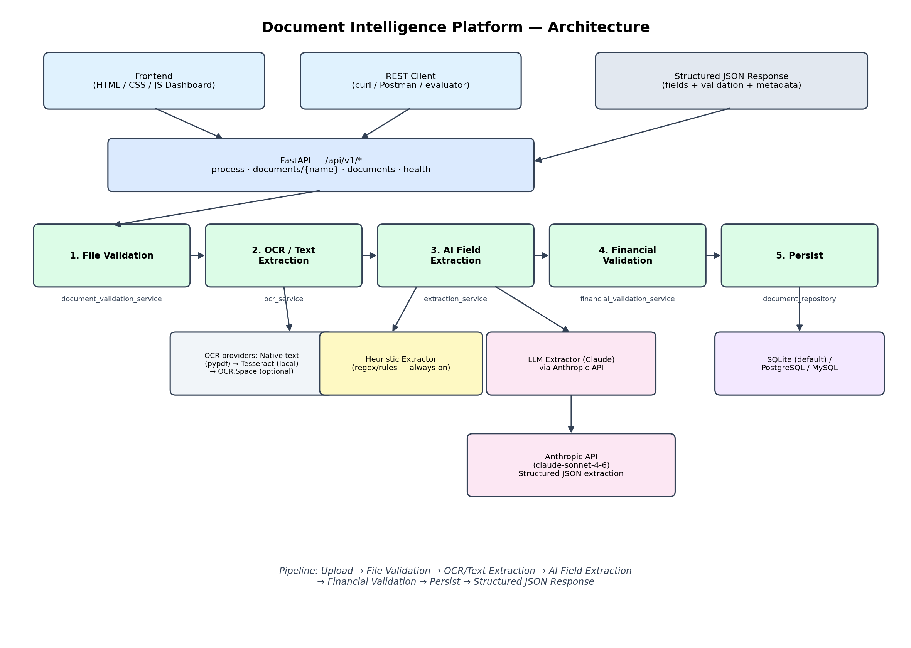

# Document Intelligence Platform

An end-to-end AI document extraction, validation, and API platform built for
the NeoStats AI Engineer Internship case study. It ingests invoices,
balance sheets, profit & loss statements, and cash flow statements
(PDF/JPG/PNG), extracts structured fields and line items, cross-checks the
extracted numbers against the required accounting formulas, and exposes
everything through a REST API and a small web dashboard.



## Pipeline

```
Upload → File Validation → OCR / Text Extraction → AI Field Extraction
       → Financial Calculation Validation → Persist → Structured JSON Response
```

Each stage is an isolated service (see `backend/app/services/`) so a
failure at any stage is caught, logged, and reported back as a clear,
structured error instead of a stack trace.

## Key design decision: it runs with zero external dependencies

Field/table extraction supports two interchangeable strategies:

- **Heuristic extractor** (default, always available) — a regex/rules-based
  extractor with no external calls. This is what runs out of the box, so
  the service is fully testable and demoable without any API key.
- **LLM extractor** (Claude, via the Anthropic API) — automatically used
  instead whenever `ANTHROPIC_API_KEY` is set in the environment. This
  gives materially better accuracy on irregular/varied document layouts.
  Any LLM could be swapped in here; Claude was used because Anthropic's
  API was the most convenient for this environment (see
  `docs/AI_USAGE_DECLARATION.md`).

`processing_metadata.extraction_method` in every response tells you which
path was actually used ("heuristic" or "llm").

## Quick start (local)

```bash
cd backend
python -m venv .venv && source .venv/bin/activate
pip install -r requirements.txt

# System dependencies (Ubuntu/Debian) — needed for OCR & PDF rasterisation:
#   sudo apt-get install tesseract-ocr poppler-utils

cp ../.env.example .env   # edit if you want to enable LLM extraction
uvicorn app.main:app --reload --port 8000
```

Open `http://localhost:8000` for the dashboard, or `http://localhost:8000/docs`
for interactive Swagger API docs.

## Running tests

```bash
cd backend
pytest tests/ -v
```

32 tests covering file validation, number/formula parsing, financial
reconciliation logic, and full end-to-end API flows (see `backend/tests/`).

## Repository structure

```
backend/
  app/
    main.py                       # FastAPI app, mounts routes + frontend
    core/                         # config, logging, db session
    models/                       # SQLAlchemy ORM models
    schemas/                      # Pydantic request/response contracts
    services/
      document_validation_service.py   # Stage 1: file integrity checks
      ocr_service.py                   # Stage 2: text extraction / OCR
      extraction_service.py            # Stage 3: LLM-first field extraction
      heuristics/                      # Stage 3 fallback: regex extractors
      financial_validation_service.py  # Stage 4: formula reconciliation
      document_service.py              # Orchestrates all stages
    repositories/                 # DB access layer
    api/routes/documents.py       # REST endpoints
    utils/                        # number parsing, custom exceptions
  tests/                          # pytest suite + fixtures
frontend/
  templates/                      # dashboard.html, document_result.html
  static/{css,js}/                # styling + API client logic
docs/
  architecture.png
  AI_USAGE_DECLARATION.md
  KNOWN_LIMITATIONS.md
  solution_presentation.pptx
sample_outputs/                   # real pipeline outputs, incl. failure cases
```

## REST API

| Method | Path | Purpose |
|---|---|---|
| `POST` | `/api/v1/documents/process` | Upload + process a document (`multipart/form-data`: `file`, `document_type`) |
| `GET` | `/api/v1/documents/{document_name}` | Retrieve the latest stored result for a document |
| `GET` | `/api/v1/documents` | List all processed documents |
| `GET` | `/api/v1/health` | Health check |

`document_type` must be one of: `invoice`, `balance_sheet`,
`profit_and_loss`, `cash_flow_statement`.

### Response shape (every field is `{value, page_number, source_text}` so
nothing is ever silently invented — missing data is `null`, not guessed):

```json
{
  "document_name": "invoice.jpg",
  "document_type": "invoice",
  "processing_status": "PASS",
  "file_validation": { "file_type": "image/jpeg", "is_supported": true, "is_readable": true, "status": "PASS" },
  "extracted_data": {
    "invoice_number": { "value": "118", "page_number": 1, "source_text": "INVOICE NO. 118" },
    "total_amount": { "value": 916.47, "page_number": 1, "source_text": "Total Due 916.47" },
    "line_items": [ { "description": "...", "quantity": 2, "unit_price": 346.0, "amount": 346.0 } ]
  },
  "validation": {
    "checks": [ { "name": "subtotal_plus_tax_minus_discount_equals_total", "formula": "...", "calculated_value": 867.47, "reported_value": 916.47, "variance": -49.0, "status": "FAIL" } ],
    "overall_status": "FAIL"
  },
  "processing_metadata": { "ocr_used": true, "extraction_method": "heuristic", "processing_time_ms": 2450 }
}
```

Note: `processing_status` reflects whether the pipeline *successfully
extracted data* from the document (PASS/FAILED). A document can be
`PASS` at the pipeline level while its `validation.overall_status` is
`FAIL` — that means extraction worked, but the numbers in the document
itself don't reconcile (see `sample_outputs/05_invoice_validation_failure_sample.json`
for a real example where the source invoice includes an S&H charge that
makes `subtotal + tax ≠ total`).

File-level rejections (unsupported type, empty file, corrupted file, too
many pages) are returned the same way, with `file_validation.status =
"FAILED"` and a human-readable `reason` — the API always returns HTTP 200
with a structured body for anything that is a well-formed request; it only
returns a 4xx/5xx `{"error": {...}}` response for malformed *requests*
themselves (e.g. an invalid `document_type`, a missing file part).

## Deploying

This is a stock FastAPI app with a SQLite default — it deploys to Render,
Railway, Fly.io, or any container host with no code changes:

1. **Render / Railway**: point the build at `backend/`, build command
   `pip install -r requirements.txt`, start command
   `uvicorn app.main:app --host 0.0.0.0 --port $PORT`. Add `tesseract-ocr`
   and `poppler-utils` as system packages (Render: use a `Dockerfile` or
   their Aptfile mechanism; Railway: `nixpacks.toml` with those apt
   packages).
2. Set environment variables from `.env.example` in the platform's
   dashboard (at minimum you can leave everything blank except
   `DATABASE_URL` if you want managed Postgres instead of SQLite).
3. For production-grade persistence, swap `DATABASE_URL` to a managed
   Postgres/MySQL instance — no application code changes needed.

See `docs/KNOWN_LIMITATIONS.md` for the current gaps and
`docs/AI_USAGE_DECLARATION.md` for how AI tools were used to build this.
